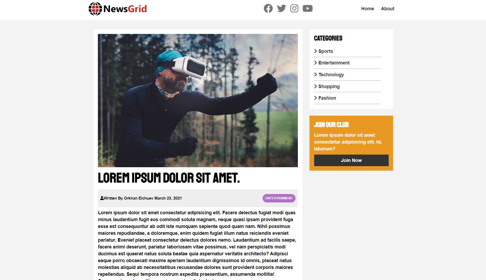

# Newsgrid-Website
#### Creating a responsive Newsgrid Website using grids with Home, Article(section/page), About pages. This website is created using HTML, CSS styling via [Brad Traversy](https://www.udemy.com/course/modern-html-css-from-the-beginning/)'s Udemy course.

## Screenshots 

### Home page 

### Article page 

### News and footer sections

## Tools used while developing this project
- Visual Studio Code
- HTML
- CSS
- Gitbash

## Acknowledgements
- [fontawesome](https://fontawesome.com/)
- [google fonts](https://fonts.google.com/)

## Contacts 
- E-mail address orkhan.elchuev@gmail.com
